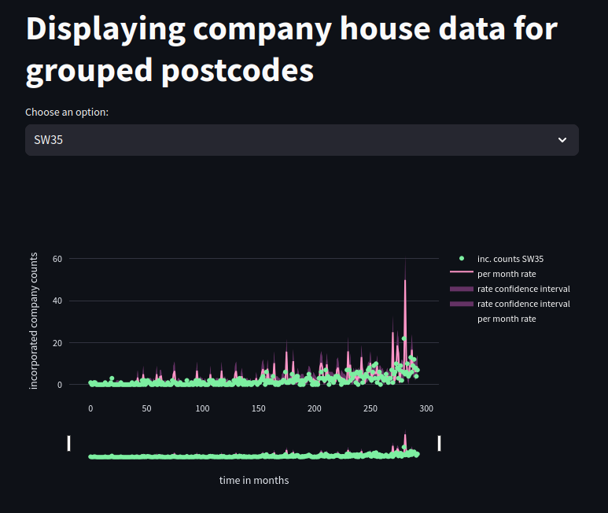

# uk_companies

Statistics on company incorporation dates from UK Companies House. 

## Setup steps

0. Assuming presence of libraries such as `numpy`, `matplotlib`, `scipy`, `h5py`, `duckdb`, `pandas`, `streamlit`

1. Navigate to [companies house website](https://download.companieshouse.gov.uk/en_output.html) and download the basic data. Here we are expecting it to be downloaded as multiple files, e.g. `BasicCompanyData-2024-07-01-part1_7.zip` etc... Place files into `companies_house_data`. 

2. Change directory to `companies_house_data`

3. Run `python extract_data.py --output_db_name=combined_data.parquet` to extract, clean and combine the companies house data into a single PARQUET file. The file of interest will be `filtered_combined_data.parquet`

4. Run 
```
python extract_company_creation_time_series.py \
    --input_db_name=filtered_combined_data.parquet \
    --incorporation_period_start_date=2000-01-01 \
    --incorporation_period_end_date=2024-06-30
    --batch_save_h5_file=extracted_time_series_batch.h5
```

to produce an H5 file with number of companies incorporated at different postcode groups. Postcode groups are created by removing few last characters from individual [UK postcodes](https://en.wikipedia.org/wiki/Postcodes_in_the_United_Kingdom). This groups postcodes located nearby. In the code such postcodes are referred to as `simplified_pc`

5. At this point one can proceed with individual analysis by working with contents of either the PARQUET database or time-series in the H5 file. An example of this is extraction of number of companies incorporated at a specific group of postcodes. Change directory to `uk_companies`
```
streamlit run  compare_traces.py -- --time_series_h5=companies_house_data/extracted_time_series_batch.h5
```



6. Interesting points to note:

* At most address groups the number of companies is growing over time
* Modelling number of companies incorporated at a specific postcode group as a Poisson process works relatively well. A bigger problem is the non-stationary nature of the incorporation rate. It has to be accounted for first
